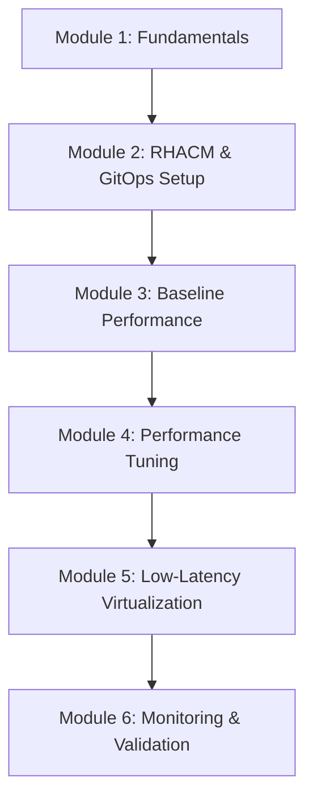

# Low-Latency Performance Workshop - Developer Guide

This guide provides comprehensive information for developers, instructors, and contributors working with the Low-Latency Performance Workshop for OpenShift 4.19.

## Table of Contents

- [Workshop Architecture](#workshop-architecture)
- [Environment Configuration](#environment-configuration)
- [Content Structure](#content-structure)
- [Development Setup](#development-setup)
- [Contributing Guidelines](#contributing-guidelines)
- [Testing and Validation](#testing-and-validation)
- [Deployment](#deployment)
- [Troubleshooting](#troubleshooting)

## Workshop Architecture

### Overview

The Low-Latency Performance Workshop is designed to teach OpenShift 4.19 performance optimization through hands-on exercises using modern tooling and GitOps practices.

### Target Environment

- **Platform**: OpenShift 4.19+ on AWS
- **Infrastructure**: Single Node OpenShift (SNO) or multi-node clusters
- **Access Pattern**: SSH bastion → OpenShift cluster
- **Domain Pattern**: `*.dynamic.redhatworkshops.io`

### Workshop Flow



## Environment Configuration

### Antora Configuration Variables

The workshop uses Antora for documentation generation with the following key variables:

```yaml
# Core Workshop Identity
product_name: OpenShift 4.19
workshop_name: Low-Latency Performance Workshop
openshift_version: 4.19
kube_burner_version: 1.17+

# Environment Access
ssh_user: ec2-user
ssh_password: ""  # Key-based authentication
ssh_command: ssh ec2-user@bastion.{guid}.dynamic.redhatworkshops.io

# Cluster Access
cluster_api: https://api.cluster-{guid}.dynamic.redhatworkshops.io:6443
cluster_console: https://console-openshift-console.apps.cluster-{guid}.dynamic.redhatworkshops.io

# CLI Tools
infractl: oc
management_cli: oc
```

### GUID-Based Environment Pattern

Each workshop participant receives a unique GUID that provides:

- **Bastion Host**: `bastion.{guid}.dynamic.redhatworkshops.io`
- **OpenShift API**: `api.cluster-{guid}.dynamic.redhatworkshops.io:6443`
- **OpenShift Console**: `console-openshift-console.apps.cluster-{guid}.dynamic.redhatworkshops.io`

### SSH Access Configuration

```bash
# Standard SSH access pattern
ssh ec2-user@bastion.{guid}.dynamic.redhatworkshops.io

# Example with actual GUID
ssh ec2-user@bastion.abc123.dynamic.redhatworkshops.io
```

**Security Notes:**
- Uses key-based authentication (no password)
- Bastion host provides secure access to OpenShift cluster
- All cluster access goes through the bastion host

### Environment Variable Usage in Content

The Antora configuration variables can be used throughout the workshop content:

```asciidoc
// SSH connection example in workshop content
Connect to your workshop environment:
[source,bash,role=execute]
----
{ssh_command}
----

// OpenShift login example
Log into your OpenShift cluster:
[source,bash,role=execute]
----
oc login {cluster_api} --username=admin
----

// Console access
Access the OpenShift web console at: {cluster_console}
```

### Workshop Environment Provisioning

#### For Workshop Administrators

The workshop environment expects the following infrastructure:

1. **AWS Environment**:
   - EC2 bastion hosts with pattern: `bastion.{guid}.dynamic.redhatworkshops.io`
   - OpenShift clusters with API: `api.cluster-{guid}.dynamic.redhatworkshops.io:6443`
   - Route53 DNS entries for `*.dynamic.redhatworkshops.io`

2. **OpenShift Cluster Requirements**:
   - OpenShift 4.19+ with cluster-admin access
   - Worker nodes with performance capabilities (preferably bare metal)
   - Sufficient resources for performance testing workloads

3. **Pre-installed Components**:
   - RHACM (Red Hat Advanced Cluster Management)
   - OpenShift GitOps (ArgoCD)
   - Node Tuning Operator (built-in to OpenShift 4.19)

#### Environment Validation Script

```bash
#!/bin/bash
# Workshop environment validation script

GUID=${1:-"your-guid-here"}

echo "🔍 Validating workshop environment for GUID: $GUID"

# Test SSH connectivity
echo "Testing SSH access..."
if ssh -o ConnectTimeout=10 ec2-user@bastion.$GUID.dynamic.redhatworkshops.io "echo 'SSH OK'"; then
    echo "✅ SSH access working"
else
    echo "❌ SSH access failed"
    exit 1
fi

# Test OpenShift API
echo "Testing OpenShift API access..."
if curl -k --connect-timeout 10 https://api.cluster-$GUID.dynamic.redhatworkshops.io:6443/healthz | grep -q "ok"; then
    echo "✅ OpenShift API accessible"
else
    echo "❌ OpenShift API not accessible"
    exit 1
fi

# Test console access
echo "Testing OpenShift console..."
if curl -k --connect-timeout 10 -I https://console-openshift-console.apps.cluster-$GUID.dynamic.redhatworkshops.io | grep -q "200 OK"; then
    echo "✅ OpenShift console accessible"
else
    echo "❌ OpenShift console not accessible"
    exit 1
fi

echo "🎉 Environment validation completed successfully!"
```

## Content Structure

### Module Organization

```
content/modules/ROOT/pages/
├── index.adoc                           # Workshop overview
├── module-01-low-latency-intro.adoc     # Fundamentals
├── module-02-rhacm-setup.adoc           # RHACM & GitOps
├── module-03-baseline-performance.adoc  # Baseline testing
├── module-04-core-performance-tuning.adoc # Performance tuning
├── module-05-low-latency-virtualization.adoc # Virtualization
└── module-06-monitoring-validation.adoc # Monitoring & validation
```

### GitOps Configuration Structure

```
gitops/
├── kube-burner-configs/          # Performance testing configurations
│   ├── config/                   # kube-burner test configurations
│   ├── workloads/                # Workload templates
│   ├── run-test.sh               # Test execution script
│   └── README.md                 # Configuration documentation
├── openshift-virtualization/     # CNV deployment configs
└── sriov-network-operator/       # SR-IOV deployment configs
```

### Performance Testing Framework

The workshop uses **kube-burner v1.17+** with modern configuration format:

```yaml
# Modern kube-burner configuration
global:
  measurements:
    - name: podLatency
      thresholds:
        - conditionType: Ready
          metric: P99
          threshold: 30000ms

metricsEndpoints:
  - indexer:
      type: local
      metricsDirectory: collected-metrics
```

## Configuration Management

### Antora Configuration Deep Dive

The `content/antora.yml` file is the central configuration for the workshop documentation. Here's a detailed breakdown:

#### Core Configuration Structure

```yaml
---
name: modules                                    # Antora component name
title: Low-Latency Performance Workshop for OpenShift 4.19  # Site title
version: main                                   # Git branch (IMPORTANT: must match repo branch)
nav:
  - modules/ROOT/nav.adoc                       # Navigation structure
```

#### Workshop-Specific Attributes

```yaml
asciidoc:
  attributes:
    # Workshop Identity
    lab_name: Welcome to the Low-Latency Performance Workshop!
    product_name: OpenShift 4.19               # Used throughout content
    workshop_name: Low-Latency Performance Workshop
    openshift_version: 4.19                    # Version-specific features
    kube_burner_version: 1.17+                 # Tool version requirements

    # Environment Access (GUID-based)
    guid: my-guid                               # Placeholder, replaced per participant
    ssh_user: ec2-user                          # AWS standard user
    ssh_password: ""                            # Key-based auth (no password)
    ssh_command: ssh ec2-user@bastion.{guid}.dynamic.redhatworkshops.io

    # OpenShift Cluster Access
    cluster_api: https://api.cluster-{guid}.dynamic.redhatworkshops.io:6443
    cluster_console: https://console-openshift-console.apps.cluster-{guid}.dynamic.redhatworkshops.io

    # CLI Tool References
    infractl: oc                                # Infrastructure CLI
    management_cli: oc                          # Management CLI
```

#### Customizing for Different Environments

**For Different Cloud Providers:**

```yaml
# AWS Environment (current)
ssh_command: ssh ec2-user@bastion.{guid}.dynamic.redhatworkshops.io
cluster_api: https://api.cluster-{guid}.dynamic.redhatworkshops.io:6443

# Azure Environment (example)
ssh_command: ssh azureuser@bastion-{guid}.eastus.cloudapp.azure.com
cluster_api: https://api.cluster-{guid}.eastus.aroapp.io:6443

# On-Premises Environment (example)
ssh_command: ssh admin@bastion-{guid}.lab.example.com
cluster_api: https://api.cluster-{guid}.lab.example.com:6443
```

**For Different OpenShift Versions:**

```yaml
# OpenShift 4.19 (current)
openshift_version: 4.19
kube_burner_version: 1.17+

# OpenShift 4.18 (example)
openshift_version: 4.18
kube_burner_version: 1.16+
```

#### Page Links Configuration

```yaml
page-links:
  - url: https://redhat.com
    text: Red Hat
  - url: https://docs.openshift.com/container-platform/4.19/scalability_and_performance/cnf-low-latency-tuning.html
    text: OpenShift Low Latency Tuning
  - url: https://kube-burner.github.io/kube-burner/latest/
    text: Kube-burner Documentation
  - url: https://github.com/tosin2013/low-latency-performance-workshop
    text: Workshop Repository
```

### Environment-Specific Customization

#### Workshop Deployment Scenarios

1. **Red Hat Workshops (Current)**:
   - Domain: `*.dynamic.redhatworkshops.io`
   - User: `ec2-user`
   - Authentication: SSH keys
   - Platform: AWS

2. **Customer Workshops**:
   - Domain: Customer-specific
   - User: Customer-specific (often `admin` or `student`)
   - Authentication: May include passwords
   - Platform: Various (AWS, Azure, VMware, bare metal)

3. **Self-Paced Learning**:
   - Domain: Learner's own environment
   - User: Varies
   - Authentication: Learner-configured
   - Platform: Any supported OpenShift environment

#### Customization Template

Create environment-specific configuration files:

```bash
# Create environment-specific configs
cp content/antora.yml content/antora-aws.yml
cp content/antora.yml content/antora-azure.yml
cp content/antora.yml content/antora-onprem.yml

# Customize each for specific environment
# Then use appropriate config during build:
antora antora-playbook-aws.yml
```

## Development Setup

### Quick Start for New Developers

We provide an automated setup script that configures your development environment:

```bash
# Clone the repository
git clone https://github.com/tosin2013/low-latency-performance-workshop.git
cd low-latency-performance-workshop

# Run the developer setup script
./scripts/developer-setup.sh
```

The setup script will:
- ✅ Check for required tools (git, node, npm, python3)
- ✅ Install optional tools (yamllint, asciidoctor, markdownlint)
- ✅ Install Node.js dependencies
- ✅ Configure git hooks for automatic document validation
- ✅ Create local development configuration
- ✅ Display next steps and useful commands

### Prerequisites

1. **Local Development Environment**:
   - Node.js 16+ (for Antora)
   - Git
   - Python 3.x
   - Text editor with AsciiDoc support

2. **Optional but Recommended**:
   - `asciidoctor` - For AsciiDoc validation
   - `yamllint` - For YAML validation (required for pre-commit hooks)
   - `markdownlint` - For Markdown validation
   - OpenShift CLI (`oc`) - For testing

3. **OpenShift Access** (for testing):
   - OpenShift CLI (`oc`)
   - Cluster admin access for testing
   - kube-burner CLI for performance testing

4. **Workshop Environment** (for testing):
   - Access to workshop bastion host
   - OpenShift cluster with performance features enabled

### Manual Setup

If you prefer to set up manually or the automated script doesn't work:

```bash
# Clone the repository
git clone https://github.com/tosin2013/low-latency-performance-workshop.git
cd low-latency-performance-workshop

# Install Node.js dependencies
npm install

# Install validation tools
pip3 install --user yamllint
gem install asciidoctor
npm install -g markdownlint-cli

# Configure git hooks
git config core.hooksPath .githooks
chmod +x .githooks/*
chmod +x scripts/*.sh

# Install Antora (if not already installed)
npm install -g @antora/cli @antora/site-generator-default
```

### Local Documentation Development

```bash
# Generate documentation locally
make build

# Serve documentation locally
make serve

# Or manually:
antora default-site.yml

# Serve with Python
cd www && python3 -m http.server 8080
```

### Testing Workshop Content

```bash
# Test kube-burner configurations
cd gitops/kube-burner-configs
./run-test.sh baseline

# Validate GitOps configurations
oc apply --dry-run=client -k gitops/openshift-virtualization/operator/overlays/sno
```

### Document Validation

The repository includes automated document validation to ensure quality and consistency.

#### Pre-commit Hooks

Pre-commit hooks automatically validate documents before allowing commits:

```bash
# Hooks are configured automatically by developer-setup.sh
# Or configure manually:
git config core.hooksPath .githooks

# Make changes and commit - validation runs automatically
git add content/modules/ROOT/pages/module-01-low-latency-intro.adoc
git commit -m "Update module 01"
```

**What gets validated:**
- ✅ **YAML files**: Syntax and structure validation with yamllint
- ✅ **AsciiDoc files**: Syntax, heading hierarchy, and formatting with asciidoctor
- ✅ **Markdown files**: Syntax and formatting with markdownlint

**Bypassing validation** (not recommended):
```bash
git commit --no-verify -m "Skip validation"
```

#### Manual Validation

You can validate documents manually at any time:

```bash
# Validate all documents
./scripts/validate-documents.sh

# Validate specific files
./scripts/validate-documents.sh content/modules/ROOT/pages/module-01-low-latency-intro.adoc

# Validate multiple files
./scripts/validate-documents.sh file1.adoc file2.yaml file3.md
```

#### Validation Requirements

**Required tools:**
- `python3` - For YAML parsing
- `yamllint` - For YAML validation

**Optional but recommended:**
- `asciidoctor` - For comprehensive AsciiDoc validation
- `markdownlint` or `mdl` - For Markdown validation

Install with:
```bash
# RHEL/Fedora
pip3 install --user yamllint
sudo dnf install rubygem-asciidoctor
npm install -g markdownlint-cli

# Ubuntu/Debian
pip3 install --user yamllint
sudo apt-get install asciidoctor
npm install -g markdownlint-cli

# macOS
pip3 install yamllint
brew install asciidoctor
npm install -g markdownlint-cli
```

## Contributing Guidelines

### Content Contribution Process

1. **Fork and Clone**: Fork the repository and create a feature branch
2. **Development Setup**: Run `./scripts/developer-setup.sh` to configure your environment
3. **Content Development**: Follow AsciiDoc best practices (see below)
4. **Validation**: Documents are validated automatically on commit
5. **Testing**: Validate content with actual workshop environment
6. **Documentation**: Update this developer guide if needed
7. **Pull Request**: Submit PR with clear description of changes

### Git Workflow

```bash
# Create a feature branch
git checkout -b feature/update-module-01

# Make your changes
vim content/modules/ROOT/pages/module-01-low-latency-intro.adoc

# Validate manually (optional - pre-commit hook will do this)
./scripts/validate-documents.sh content/modules/ROOT/pages/module-01-low-latency-intro.adoc

# Build and test locally
make clean-build
make serve

# Commit changes (validation runs automatically)
git add content/modules/ROOT/pages/module-01-low-latency-intro.adoc
git commit -m "Update module 01: Add new performance tuning section"

# Push to your fork
git push origin feature/update-module-01

# Create pull request on GitHub
```

### AsciiDoc Style Guidelines

```asciidoc
= Module Title (Level 0 - Document Title)

== Section Title (Level 1)

=== Subsection Title (Level 2)

==== Sub-subsection Title (Level 3)

// Use consistent formatting for code blocks
[source,bash,role=execute]
----
oc get nodes
----

// Use consistent formatting for YAML
[source,yaml,role=execute]
----
apiVersion: v1
kind: Pod
metadata:
  name: example
----
```

### Performance Testing Guidelines

1. **Use Modern kube-burner**: Always use v1.17+ configuration format
2. **Meaningful Thresholds**: Set realistic performance thresholds
3. **Comprehensive Testing**: Test all optimization types (pods, VMIs, network policies)
4. **Documentation**: Document expected performance outcomes

### GitOps Configuration Guidelines

1. **Kustomize Structure**: Use proper kustomize overlays for different environments
2. **Version Pinning**: Pin operator versions for reproducibility
3. **Environment Flexibility**: Support both SNO and multi-node deployments
4. **Security**: Follow OpenShift security best practices

## Testing and Validation

### Pre-Deployment Testing

```bash
# Validate AsciiDoc syntax
asciidoctor --safe-mode=safe --failure-level=WARN content/modules/ROOT/pages/*.adoc

# Test kube-burner configurations
cd gitops/kube-burner-configs
for config in config/*.yml; do
    echo "Validating $config"
    kube-burner init -c "$config" --dry-run
done

# Validate GitOps configurations
find gitops/ -name "*.yaml" -o -name "*.yml" | xargs -I {} oc apply --dry-run=client -f {}
```

### Workshop Environment Testing

```bash
# Test complete workshop flow
cd ~/kube-burner-configs
./comprehensive-validation.sh

# Verify all operators are deployed
oc get csv -A | grep -E "(kubevirt|sriov|node-tuning)"

# Check performance profile status
oc get performanceprofile
```

## Deployment

### Antora Site Generation

The workshop documentation is generated using Antora and can be deployed to various platforms:

```bash
# Generate static site
antora antora-playbook.yml

# Deploy to GitHub Pages (example)
# The build/site directory contains the generated documentation
```

### Workshop Environment Deployment

The workshop uses RHACM and ArgoCD for GitOps-based deployment:

1. **Hub Cluster**: RHACM and ArgoCD for management
2. **Target Clusters**: Workshop clusters with performance optimizations
3. **GitOps Applications**: Automated deployment of operators and configurations

## Troubleshooting

### Common Issues

#### 1. SSH Access Problems

```bash
# Check SSH key configuration
ssh-add -l

# Test SSH connection
ssh -v ec2-user@bastion.{guid}.dynamic.redhatworkshops.io

# Check bastion host status
ping bastion.{guid}.dynamic.redhatworkshops.io
```

#### 2. OpenShift Access Issues

```bash
# Check cluster API accessibility
curl -k https://api.cluster-{guid}.dynamic.redhatworkshops.io:6443/healthz

# Verify oc login
oc whoami
oc cluster-info
```

#### 3. Performance Testing Issues

```bash
# Check kube-burner version
kube-burner version

# Validate configuration syntax
kube-burner init -c config.yml --dry-run

# Check cluster resources
oc get nodes -l node-role.kubernetes.io/worker-rt
oc get performanceprofile
```

#### 4. GitOps Deployment Issues

```bash
# Check ArgoCD application status
oc get applications -n openshift-gitops

# Verify operator installations
oc get csv -A | grep -E "(kubevirt|sriov)"

# Check operator logs
oc logs -n openshift-cnv deployment/hco-operator
```

### Performance Troubleshooting

#### Expected Performance Baselines

| Test Type | Expected P99 | Threshold | Troubleshooting |
|-----------|--------------|-----------|-----------------|
| **Baseline Pods** | ~5-10s | < 30s | Check cluster resources, node health |
| **Tuned Pods** | ~3-7s | < 15s | Verify performance profile, CPU isolation |
| **VMI Startup** | ~30-40s | < 45s | Check CNV installation, HugePages |
| **Network Policy** | ~2-4s | < 5s | Verify network operator, policy syntax |

#### Debug Commands

```bash
# Check performance profile status
oc get performanceprofile -o yaml

# Verify CPU isolation
oc get nodes -o jsonpath='{.items[*].metadata.annotations.cpu-load-balancing\.crio\.io}'

# Check HugePages allocation
oc get nodes -o jsonpath='{.items[*].status.allocatable.hugepages-1Gi}'

# Monitor kube-burner execution
tail -f kube-burner-*.log
```

## Support and Community

### Getting Help

1. **GitHub Issues**: Report bugs and request features
2. **Documentation**: Refer to linked resources in each module
3. **Community**: Engage with OpenShift and kube-burner communities

### Contributing Back

1. **Performance Data**: Share performance results and optimizations
2. **Bug Fixes**: Submit fixes for issues you encounter
3. **Content Improvements**: Enhance documentation and exercises
4. **New Features**: Propose and implement new workshop capabilities

---

**Last Updated**: 2025-01-06  
**Workshop Version**: OpenShift 4.19  
**kube-burner Version**: 1.17+
